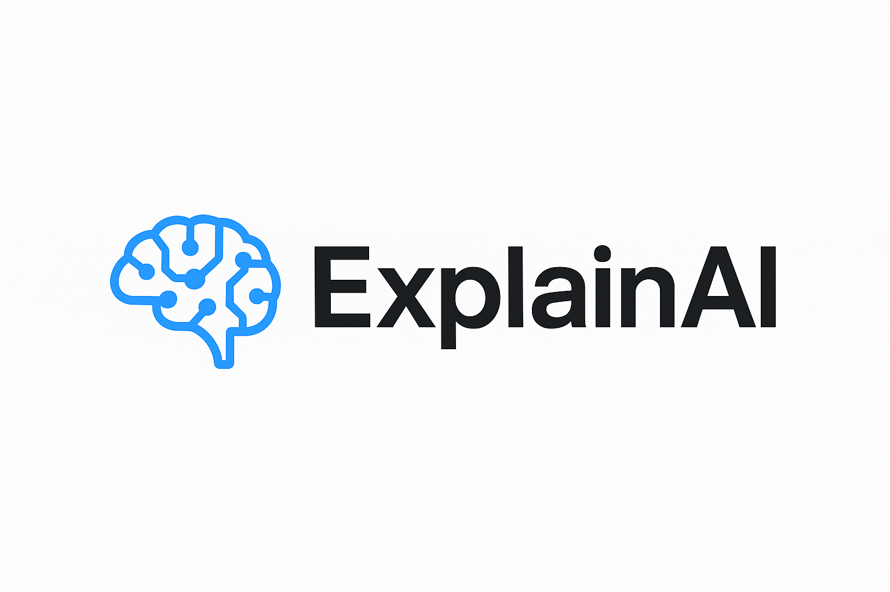
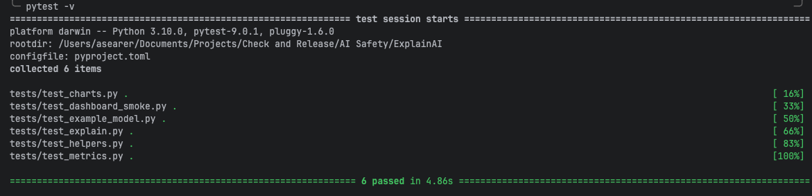
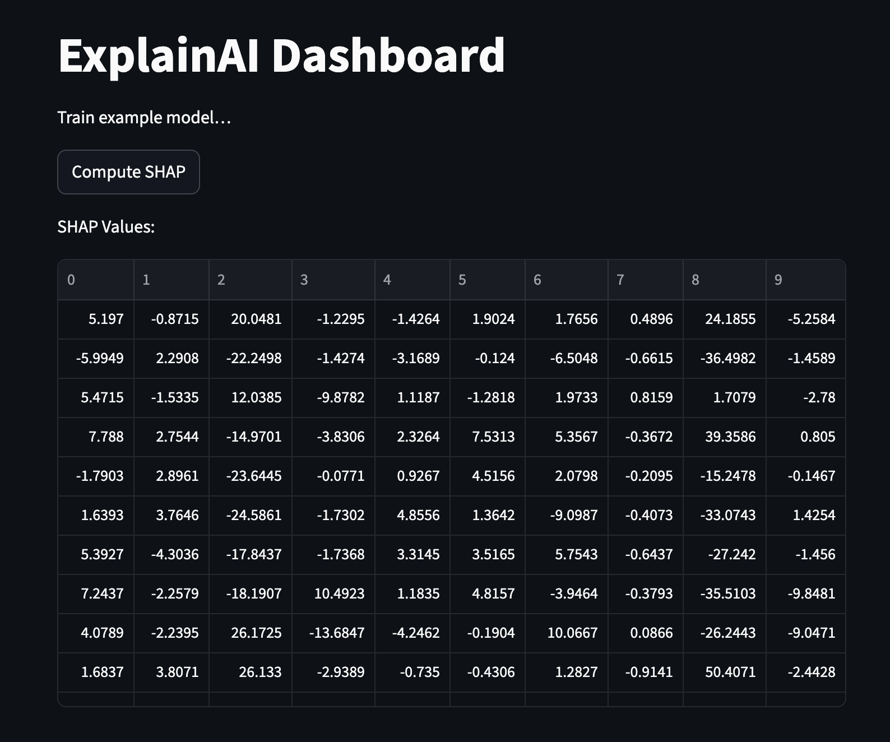

# ExplainAI




[](https://www.python.org/)
[](https://codecov.io/gh/asearer/ExplainAI)
[](https://streamlit.io/)
[](LICENSE)

---

## 📌 Purpose

**ExplainAI** is a Python library and interactive dashboard for interpreting and explaining machine learning models. Its main goal is to provide **transparent, human-understandable explanations** of model predictions using **SHAP values**, enabling data scientists, researchers, and business users to trust and validate AI systems.

The included Streamlit dashboard lets you visualize these explanations interactively with no additional coding required.

---

## 🧠 What are SHAP values?

SHAP (SHapley Additive exPlanations) is a method for **quantifying how much each feature contributes** to a model’s prediction.

Key advantages:

* Based on **Shapley values** from cooperative game theory
* Assigns **positive or negative contributions**
* Makes black-box models interpretable
* Highlights **root causes, biases, and high-impact features** for each prediction

Example:

> In a churn prediction model, SHAP can show whether contract length, support calls, or monthly charges were most influential for a specific customer.

---

## ⚡ Current Features

* Train example models and compute SHAP explanations
* Interactive Streamlit dashboard for model exploration
* Modular design that makes it easy to plug in your own models
* Helper utilities for metrics, plotting, and preprocessing
* Clean, extensible architecture suitable for larger ML pipelines

---

## 🚀 Getting Started

### 1. Clone the repository

```bash
git clone https://github.com/asearer/ExplainAI.git
cd ExplainAI
```

### 2. Install dependencies

```bash
pip install -r requirements.txt
```

### 3. Run the Streamlit dashboard

```bash
cd src
PYTHONPATH="./src" streamlit run dashboard/app.py
```

Visit: [http://localhost:8501](http://localhost:8501)

---

## 🖼️ Screenshots

### Test results



### Dashboard



---

## 🛠️ API Usage

### Train an example model

```python
from explainai.models.example_model import train_example_model

model, X_train, y_train = train_example_model()
```

### Compute SHAP values

```python
from explainai.explain import compute_shap_values

shap_values = compute_shap_values(model, X_train)
```

### Visualize feature importance

The Streamlit dashboard provides automatic SHAP visualization.

---

## 📂 Current Project Structure

```
src/
 ├─ explainai/
 │   ├─ __init__.py
 │   ├─ explain.py
 │   ├─ models/
 │   │   ├─ __init__.py
 │   │   └─ example_model.py
 │   ├─ metrics.py
 │   ├─ charts.py
 │   └─ helpers.py
 └─ dashboard/
     └─ app.py
```

---

# 🧭 Planned Features & Future Roadmap

*This section reflects upcoming enhancements that are already being designed and planned but not yet implemented.*

## 1. 🌐 Public Demo Hosting

 A **fully hosted demo site** is planned, likely using:

* **GitHub Pages** (static, for docs + demo UI)
* **Streamlit Cloud** or **HuggingFace Spaces** for the interactive explainer
* **Single-file demo build** for embedding anywhere

This will allow users to try ExplainAI without running Python locally.

---

## 2. 🖥️ Advanced Streamlit Dashboard (Major Upgrade)

A fully redesigned multi-tab dashboard including:

* Dataset explorer
* Model training panel
* SHAP summary + individual prediction explorer
* Metrics panel (ROC, precision/recall, drift indicators)
* Real-time interactions for any loaded model
* Screenshot-ready visualizations

Future versions will also include **theme customization** and **prebuilt templates for common use cases**.

---

## 3. 🤖 Local Model Support & Pluggable Backends

Planned support:

* **Custom user models** (scikit-learn, XGBoost, LightGBM, PyTorch, TensorFlow)
* **Local inferencing modules** to allow low-latency experimentation
* Automatic adapter detection
* Export/import of explanation sessions

This will turn ExplainAI into a reusable explainability module for research, apps, and pipelines.

---

## 4. 📚 Expanded ML Interpretation Toolkit

Upcoming additions:

* Feature interaction explanations
* Counterfactual examples
* Partial dependence plots
* Global vs Local explanation comparisons
* Error analysis and cohort analysis

These features will make ExplainAI useful in **regulatory**, **auditing**, and **enterprise ML governance** workflows.

---

## 5. 🧱 New Project Structure (Planned)

The directory layout will soon expand to include:

```
src/
 ├─ explainai/
 │   ├─ backends/          # model adapters (planned)
 │   ├─ pipelines/         # end-to-end processing pipelines
 │   ├─ local_models/      # local inference support
 │   ├─ visual/
 │   ├─ data/
 │   ├─ utils/
 └─ dashboard/
     ├─ components/
     ├─ pages/
     └─ assets/
```

---

## 6. 🌍 Real-World Use Case Library

Example notebooks and real datasets will be included demonstrating:

* Fraud detection explanations
* Customer churn drivers
* Healthcare risk modeling
* Credit scoring fairness audits

These serve both as demos and starting points for customization.

---

## 7. 🧪 Testing, CI, and Coverage Expansion

Planned improvements:

* Full unit + integration test coverage
* Model adapter tests
* Dashboard behavior tests
* Continuous deployment hooks for demo hosting

---

## 8. 📦 Packaging & Distribution

Future releases will include:

* pip-installable package (`pip install explainai`)
* Conda distribution
* Versioned documentation site
* Prebuilt assets for demos and tutorials

---

## 📜 License

MIT License — see [LICENSE](LICENSE).

